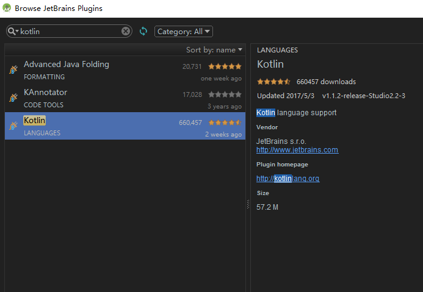
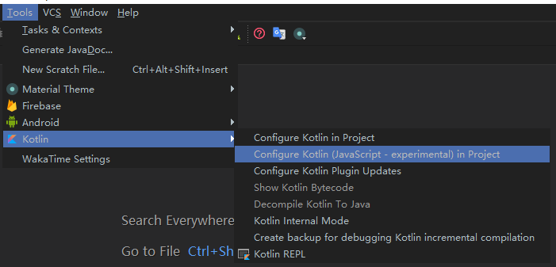
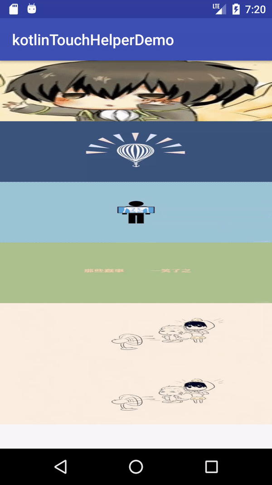

# kotlinTouchHelperDemo
### kotlin + 列表拖拽重新排序、滑动进行删除

<a href="http://www.jianshu.com/p/2e591df06d73">鼓励传送门</a>

其实在一个月前就想写个kotlin的Demo，想在kotlin成为Android的主流开发语言之前学习学习它.
但是中间一直没有时间，正好这几天Google I/O大会，Kotlin都上热搜了，我利用下班后的时间将写的kotlin例子来和大家分享下，让大家感受感受这门神奇的语言.

> kotlin

**来，先贴上官方对于这门语言的介绍以及官方为何放弃Java而最终选择kotlin**
1. Kotlin 介绍
  - Kotlin是一个基于JVM 实现的静态语言. Kotlin是IntelliJ公司创造并在持续维护这门语言.
2. 优点
  - 帮你减少实现同一个功能的代码量.
  - 让你的代码更容易阅读，同时易于理解.
  - 移除了你可能会犯错误的功能.
  - 基于 JVM 和 Javascript，你可以在很多地方运行.
  - Kotlin 和 Java 可以相互调用 .
3. 为何放弃Java
  - 兼容性问题 （Java 7 只支持 API 19 及以上，以及AndroidStudio对于Java 8的新特性支持迟迟没有完善）
  - Java 存在问题 <br/>
   a. 空引用 : 不论你费多大的功夫，你都无法避免它.因为 Java 的类型系统就是不安全的 .<br/>
   b. 原始类型 : 我们在开发的时候总是会为了保持兼容性而卡在范型原始类型的问题上，我们都知道要努力避免 raw type 的警告，但是它们毕竟是在语言层面上的存在，这必定会造成误解和不安全因素.<br/>
   c. 协变数组 : 你可以创建一个 string 类型的数组和一个 object 型的数组，然后把 string 数组分配给 object 数组.这样的代码可以通过编译，但是一旦你尝试在运行时分配一个数给那个数组的时候，他就会在运行时抛出异常. <br/>
   d. Java 8 存在高阶方法 : 但是他们是通过 SAM 类型 实现的.SAM 是一个单个抽象方法，每个函数类型都需要一个对应的接口.如果你想要创建一个并不存在的 lambda 的时候或者不存着对应的函数类型的时候，
   你要自己去创建函数类型作为接口. <br/>
   e. 泛型中的通配符 : 诡异的泛型总是难以操作，难以阅读，书写，以及理解. 对编译器而言，异常检查也变得很困难.

4. 为何选择Kotlin
  - 对于上面Java存在的问题 很好的解决了.
  - 添加新特性 <br/>
    a. Lambda 表达式 （Java8 才有）<br/>
    b. 数据类 <br/>
    c. 函数字面量和内联函数 <br/>
    d. 函数扩展 <br/>
    e. 空安全 <br/>
    f. 智能转换 <br/>
    g. 字符串模板 <br/>
    h. 类委托 <br/>
    i. 类型推断 <br/>
    j. 声明点变量 <br/>
    k. 区间表达式 <br/>
    ...

简单介绍完了kotlin，说下小编对于这门新语言的感受吧 -- **嗨到不行!**

> kotlin 在Android Studio 中的使用。

在最新版的AS3.0中将可以直接使用Kotlin作为开发语言，但是3.0之前版本则需要通过安装kotlin的插件来进行配置并使用kotlin。




下面我将通过一个功能实现，来带大家看下kotlin的代码.

> 列表拖拽重新排序 + 滑动删除实现原理

简述原理：主要通过使用recyclerview 提供的ItemTouchHelper 来实现效果。

1. app/build.gradle 配置 (此处我用的recyclerview版本是25.3.1，可以选择其他版本)
    ```
    compile 'com.android.support:recyclerview-v7:25.3.1'
    ```

2. RecyclerView.Adapter中使用ItemTouchHelper详解：

    - ItemTouchHelper.Callback 来实现用户手势的控制以及数据的操作 <br/>

      1. getMovementFlags : 通过调用 getMovementFlags，告诉RecyclerView可以实现的手势类型 <br/>
      2. onMove ： 拖拽时回调的方法，返回值决定是否可以长按拖拽
      3. onSwiped : 左右滑动到满足删除时的回调方法，可以此处执行删除数据
      4. isLongPressDragEnabled ： 是否可以长摁拖拽
      5. isItemViewSwipeEnabled ： 是否可以滑动删除
      6. onSelectedChanged ：状态改变回调方法，可以在此处用于更换图片背景。
      7. clearView ：拖动完成回调方法，此处用于更换图片背景

      <br/>
      **上面只是简单的对于函数的介绍，详细的操作在下面的代码中可以了解到。**

      ```
      //kotlin 如果内部类需要访问外部类数据 则要声明为inner
        inner class ItemDragHelperCallback : ItemTouchHelper.Callback() {
            /**
             * 获取可以拖动的方向标志
             * */
            override fun getMovementFlags(recyclerView: RecyclerView?, viewHolder: RecyclerView.ViewHolder?): Int {
                //此处返回可以拖动的方向值
                var swipe = 0
                var move = 0
                //此处为 假设recyclerview 不为空
                recyclerView?.let {
                    if (recyclerView.layoutManager is GridLayoutManager) {
                        //如果是网格型 则可以左右上下都可以拖动
                        move = ItemTouchHelper.UP or ItemTouchHelper.DOWN or ItemTouchHelper.LEFT or ItemTouchHelper.RIGHT
                    } else if (recyclerView.layoutManager is LinearLayoutManager) {
                        //支持上下拖动
                        move = ItemTouchHelper.UP or ItemTouchHelper.DOWN
                        //左右滑动删除
                        swipe = ItemTouchHelper.START or ItemTouchHelper.END
                    }
                }
                return ItemTouchHelper.Callback.makeMovementFlags(move, swipe)
            }

            override fun onMove(recyclerView: RecyclerView?, viewHolder: RecyclerView.ViewHolder?, target: RecyclerView.ViewHolder?): Boolean {
                //此处的返回值 决定是否可以拖动
                if (viewHolder != null && target != null) {
                    //此处不让标题来进行拖动效果 也就是拖动时 标题不会动
                    if (viewHolder.itemViewType == TYPE_TITLE || target.itemViewType == TYPE_TITLE) {
                        return false
                    }

                    val fromPos = viewHolder.adapterPosition
                    val toPos = target.adapterPosition
                    //此处为mData不为空时
                    mData?.let {
                        val from = mData[fromPos]
                        mData.removeAt(fromPos)
                        mData.add(toPos, from)
                        //执行交换动画
                        notifyItemMoved(fromPos, toPos)
                        return true
                    }
                }
                //默认不让拖动
                return false
            }

            override fun onSwiped(viewHolder: RecyclerView.ViewHolder?, direction: Int) {
                //用于执行滑动删除
            }

            //不重写默认是返回true的 如果返回false的话 需要使用ItemTouchHelper的实例方法
            //使用 startDrag 来执行拖拽
            //使用 startSwipe 来执行滑动删除
            override fun isLongPressDragEnabled(): Boolean {
                return true
            }

            //是否支持滑动功能
            override fun isItemViewSwipeEnabled(): Boolean {
                return true
            }

            /**
             * 此处用于状态变化时 更换图片状态
             * */
            override fun onSelectedChanged(viewHolder: RecyclerView.ViewHolder?, actionState: Int) {
                super.onSelectedChanged(viewHolder, actionState)
                if (actionState != ItemTouchHelper.ACTION_STATE_IDLE) {
                    //显示遮罩
                    viewHolder?.let {
                        if (viewHolder is ItemViewHolder) {
                            viewHolder.mShadow!!.visibility = View.VISIBLE
                        }
                    }
                }
            }

            /**
             * 此处当拖拽完成
             * */
            override fun clearView(recyclerView: RecyclerView?, viewHolder: RecyclerView.ViewHolder?) {
                super.clearView(recyclerView, viewHolder)
                //隐藏遮罩
                viewHolder?.let {
                    if (viewHolder is ItemViewHolder) {
                        viewHolder.mShadow!!.visibility = View.GONE
                    }
                }
            }

        }
      ```
    - ItemTouchHelper 当需要自定义条件才执行拖拽或者滑动删除，则可以使用startDrag、startSwipe来主动调用开始拖拽与滑动，并isLongPressDragEnabled与
    isItemViewSwipeEnabled返回false。

    ```
    //开始执行滑动
    ItemTouchHelper.startSwipe(RecyclerView.ViewHolder)
    //开始执行拖拽
    ItemTouchHelper.startDrag(RecyclerView.ViewHolder)
    ```

    - ItemTouchHelper.attachToRecyclerView 当一切设置好了，则调用此方法设置到RecyclerView中。

    ```
     //将recyclerView依附到触摸辅助类
     open fun attachiToRecyclerView(recyclerView: RecyclerView) {
         if (mItemTouchHelper != null && recyclerView != null) {
             mItemTouchHelper.attachToRecyclerView(recyclerView)
         }
     }
    ```

> 效果图



